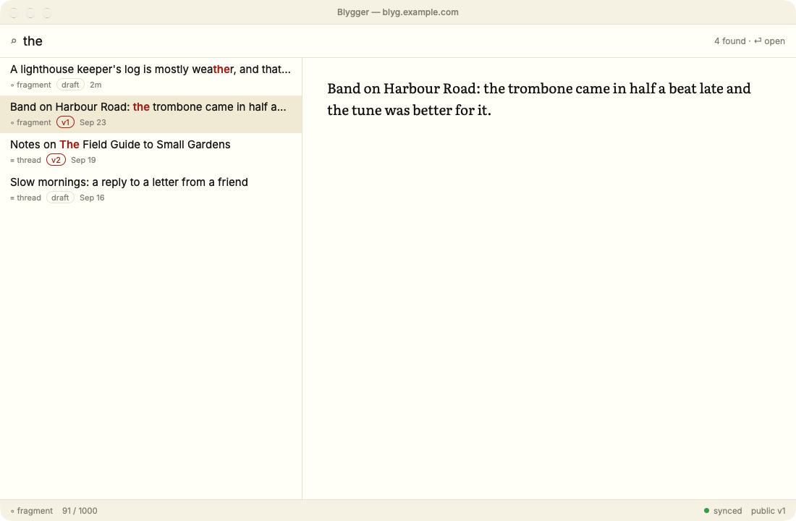

# Burrow

**Burrow is a blygger client:** a native macOS studio for
[Blygger](https://blygger.org) blogs ("blygs"), built to be as fast as
Notational Velocity.

There's one window: type to search, press ⏎ to create, and nothing ever waits
on the network. Everything you write is saved on your Mac first and synced to
your blyg in the background. It's written in Rust with
[GPUI](https://www.gpui.rs), the UI framework behind Zed.

Burrow was called Blygger Desktop up to 0.6.0. See
[the rename](https://aneeshsathe.github.io/blygger-desktop/install.html#the-rename).



## Install

```sh
curl -fsSL https://raw.githubusercontent.com/aneeshsathe/blygger-desktop/main/scripts/install.sh | bash
```

This puts **Burrow.app** in `/Applications`, checked against the release's
signed checksums. Requires macOS 11 or later. Burrow then updates itself.
Other ways to install, and what to do when macOS blocks a browser download,
are in [the docs](https://aneeshsathe.github.io/blygger-desktop/install.html).

Burrow works with any blyg on blygger-studio 0.9 or later: sign in with your
studio password. A server with a few extra owner-API extensions gets a little
more ([server requirements](https://aneeshsathe.github.io/blygger-desktop/server.html)).
No blyg? Try it on the built-in sample data.

## Links

- **[Documentation](https://aneeshsathe.github.io/blygger-desktop/)**: getting
  started, writing and reading, AI helpers, configuration, shortcuts, and the
  developer docs.
- [Releases](https://github.com/aneeshsathe/blygger-desktop/releases)
- [CHANGELOG](CHANGELOG.md)

## Disclaimer

> **Burrow is entirely vibecoded:** it was written with AI assistance.
> It's provided **as is, with no warranty or guarantee of any kind**, and you
> use it **at your own risk**. That includes the risk of losing or corrupting
> posts on your blyg. Keep backups.
>
> THE SOFTWARE IS PROVIDED "AS IS", WITHOUT WARRANTY OF ANY KIND, EXPRESS OR
> IMPLIED, INCLUDING BUT NOT LIMITED TO THE WARRANTIES OF MERCHANTABILITY,
> FITNESS FOR A PARTICULAR PURPOSE AND NONINFRINGEMENT. IN NO EVENT SHALL THE
> AUTHORS OR COPYRIGHT HOLDERS BE LIABLE FOR ANY CLAIM, DAMAGES OR OTHER
> LIABILITY, WHETHER IN AN ACTION OF CONTRACT, TORT OR OTHERWISE, ARISING
> FROM, OUT OF OR IN CONNECTION WITH THE SOFTWARE OR THE USE OR OTHER DEALINGS
> IN THE SOFTWARE. (See [LICENSE](LICENSE).)

## Contributing

Issues and pull requests are welcome. Start with
[Building and testing](https://aneeshsathe.github.io/blygger-desktop/dev/building.html)
and [the architecture](https://aneeshsathe.github.io/blygger-desktop/dev/architecture.html).
Every commit must pass
`cargo fmt && cargo clippy --workspace --all-targets -- -D warnings && cargo test --workspace`.
This is a public repository: use `blyg.example.com` and invented sample
content, never personal data, and never test against a real blyg.

## License

Different parts of the project are under different licenses:

| What | License |
|---|---|
| Source code (everything not listed below) | [MIT](LICENSE) |
| Documentation, the docs site (`site/`), design mockups and screenshots (`docs/`), and the icon and artwork (`packaging/icon.svg`, `packaging/Burrow.icns`) | [CC BY 4.0](LICENSE-docs). Reuse is fine with credit to "Blygger Desktop contributors". |
| Bundled fonts (`crates/blyg-app/assets/fonts/`) | Their own licenses: Literata, Inter, Source Serif 4 and iA Writer Quattro are under the SIL Open Font License 1.1, and ET Book is under MIT |

The license texts ship inside the app bundle. See
[packaging/THIRD_PARTY.md](packaging/THIRD_PARTY.md) for the fonts and the
Rust dependencies' licenses.
